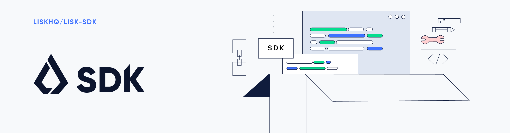

# Lisk SDK

[](http://www.gnu.org/licenses/gpl-3.0)
[](https://gitter.im/LiskHQ/lisk?utm_source=badge&utm_medium=badge&utm_campaign=pr-badge&utm_content=badge)

## Disclaimer - Mostly Harmless

Please read our disclaimer carefully. We have just opened access to our alpha version of the Lisk SDK and hope to receive detailed feedback. Using our alpha release might still be tedious due to the evolving nature of our work-in-progress code.

We strictly encourage everyone to not use our alpha release for any production blockchain applications. There will be significant changes in the protocol and public interfaces in upcoming releases.

Have fun with our alpha release to build blockchain applications but don't expect to persist your data with future releases of our Lisk SDK. Blockchains created with this release may not be compatible anymore with future releases.

## What is Lisk SDK

Lisk SDK provides an easy, secure and scalable way to create blockchain applications in JavaScript. 

It facilitate developers to create their blockchain ledgers which follow [Lisk Protocol](https://lisk.io/documentation/lisk-protocol). 

All the tools, IDEs that you are experienced to built backend applications will still applies developing with Lisk SDK.

### Architecture Overview

Lisk SDK is collection of framework, libraries and command line tools to facilitate every aspect for developing a blockchain application. It will hide the complexity of the technology and expose an elegant and easy to use and accessible interfaces for developers. The conceptual stack for our SDK is shown below.

```
                                  Lisk SDK Ecosystem

                                +----------------------+
                                |                      |
                                |    Lisk Commander    |
                                |                      |
                                +----------------------+

                                +----------------------+
                                |                      |
                                |   Your Application   |
                                |                      |
                     |----------+----------------------+----------|
                     |                                            |
                     |               Lisk Framework               |
                     |                                            |
          -----------|----------|----------|-----------|----------|-----------
          |          |          |          |           |          |          |
          |          |          |    Lisk Elements     |          |          |
          |          |          |          |           |          |          |
     +----------------------------------------------------------------------------+
     |                                                                            |
     |                               NodeJS Runtime                               |
     |                                                                            |
     +----------------------------------------------------------------------------+
```

## Package Directories

| Directory                  | Description                                                                                                          |
| -------------------------- | -------------------------------------------------------------------------------------------------------------------- |
| [Framework](./framework)   | Lisk Framework which is responsible to glue up all pieces together an first point of interaction for any developer.  |
| [Elements](./elements)   | Lisk Elements which is collection of libraries performing and dedicated to one particular domain in Lisk eco-system. |
| [Commander](./commander) | Its a command line utility to facilitate day to day Lisk management and development activities.                      |

## Installation

### Dependencies

Following dependencies need to be installed to run applications created with Lisk SDK:

| Dependencies     | Version |
| ---------------- | ------- |
| NodeJS           | 10.14.3 |
| PostgreSQL       | 10+     |
| Redis (optional) | 5+      |

You can find further details on installing these dependencies on our [documentation guide](https://lisk.io/documentation/lisk-core/setup/source#pre-install).

### Installation of Lisk SDK

To start with Lisk SDK you need to install one npm package - `lisk-framework`:

```
npm install lisk-framework
```

## Usage

The development flow is standard as you do with any NodeJS backend application. Here are few steps to get started.

```bash
mkdir my_app
cd my_app
npm init
npm install --save lisk-framework
```

At this point you will have an entry file in the directory called `index.js`. You can copy past following code in that file to start with.

```js
const { Application, SampleGenesisBlock } = require('lisk-framework');

const errorHandler = error => {
	console.error('Faced error in application', error);
	process.exit(1);
};

try {
	const app = new Application('my-app', SampleGenesisBlock);

	app
		.run()
		.then(() => app.logger.info(' App started...'))
		.catch(errorHandler);
} catch (error) {
	errorHandler(error);
}
```

After that you can start the application by:

```
node index.js
```

For more details on application and other configurations along with more samples please visit Lisk official [documentation portal](http://docs.lisk.io).

## Get Involved

|                           |                                                                                                                                  |
| ------------------------- | -------------------------------------------------------------------------------------------------------------------------------- |
| Found a bug               | [Create new issue](https://github.com/LiskHQ/lisk/issues/new)                                                                    |
| Want to develop with us   | [Create a fork](https://github.com/LiskHQ/lisk/fork)                                                                             |
| Have ideas to share       | [Come to Lisk.chat](http://lisk.chat)                                                                                            |
| Want to involve community | [Join community gitter](https://gitter.im/LiskHQ/lisk?utm_source=badge&utm_medium=badge&utm_campaign=pr-badge&utm_content=badge) |
| Found a security issue    | [See our bounty program](https://blog.lisk.io/announcing-lisk-bug-bounty-program-5895bdd46ed4)                                   |

## License

Copyright © 2016-2018 Lisk Foundation

This program is free software: you can redistribute it and/or modify it under the terms of the GNU General Public License as published by the Free Software Foundation, either version 3 of the License, or (at your option) any later version.

This program is distributed in the hope that it will be useful, but WITHOUT ANY WARRANTY; without even the implied warranty of MERCHANTABILITY or FITNESS FOR A PARTICULAR PURPOSE. See the GNU General Public License for more details.

You should have received a copy of the [GNU General Public License](https://github.com/LiskHQ/lisk/tree/master/LICENSE) along with this program. If not, see <http://www.gnu.org/licenses/>.

---

This program also incorporates work previously released with lisk `0.9.11` (and earlier) versions under the [MIT License](https://opensource.org/licenses/MIT). To comply with the requirements of that license, the following permission notice, applicable to those parts of the code only, is included below:

Copyright © 2016-2018 Lisk Foundation
Copyright © 2015 Crypti

Permission is hereby granted, free of charge, to any person obtaining a copy of this software and associated documentation files (the "Software"), to deal in the Software without restriction, including without limitation the rights to use, copy, modify, merge, publish, distribute, sublicense, and/or sell copies of the Software, and to permit persons to whom the Software is furnished to do so, subject to the following conditions:

The above copyright notice and this permission notice shall be included in all copies or substantial portions of the Software.

THE SOFTWARE IS PROVIDED "AS IS", WITHOUT WARRANTY OF ANY KIND, EXPRESS OR IMPLIED, INCLUDING BUT NOT LIMITED TO THE WARRANTIES OF MERCHANTABILITY, FITNESS FOR A PARTICULAR PURPOSE AND NONINFRINGEMENT. IN NO EVENT SHALL THE AUTHORS OR COPYRIGHT HOLDERS BE LIABLE FOR ANY CLAIM, DAMAGES OR OTHER LIABILITY, WHETHER IN AN ACTION OF CONTRACT, TORT OR OTHERWISE, ARISING FROM, OUT OF OR IN CONNECTION WITH THE SOFTWARE OR THE USE OR OTHER DEALINGS IN THE SOFTWARE.
