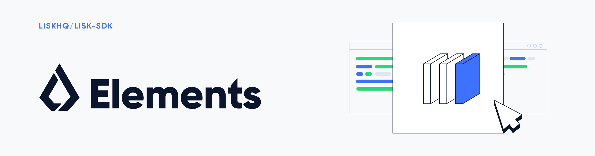

# Lisk Elements

[](http://www.apache.org/licenses/LICENSE-2.0)

## What is Lisk Elements

Lisk Elements is a collection of libraries, each of them implementing some form of blockchain application functionality such as cryptography, transactions, p2p, etc. Each library is designed to be compatible with the [Lisk Protocol](https://lisk.io/documentation/lisk-protocol).

Lisk Elements supports the modular architecture of the Lisk SDK, where libraries can be created or modified to suit individual blockchain application requirements.

## Packages

| Package                                                          |                                                        Version                                                        | Description                                                        |
| ---------------------------------------------------------------- | :-------------------------------------------------------------------------------------------------------------------: | ------------------------------------------------------------------ |
| [lisk-elements](/elements/lisk-elements)                         |         [](https://www.npmjs.com/package/lisk-elements)         | Package contains everything                                        |
| [@liskhq/lisk-client](/elements/lisk-client)                     |      [](https://www.npmjs.com/package/@liskhq/lisk-client)      | A default set of Elements for use by clients of the Lisk network   |
| [@liskhq/lisk-api-client](/elements/lisk-api-client)             |    [](https://www.npmjs.com/package/@liskhq/lisk-api-client)    | An API client for the Lisk network                                 |
| [@liskhq/lisk-constants](/elements/lisk-constants)               |    [](https://www.npmjs.com/package/@liskhq/lisk-constants)     | General constants for use with Lisk-related software               |
| [@liskhq/lisk-cryptography](/elements/lisk-cryptography)         |   [](https://www.npmjs.com/package/@liskhq/lisk-cryptography)   | General cryptographic functions for use with Lisk-related software |
| [@liskhq/lisk-passphrase](/elements/lisk-passphrase)             |    [](https://www.npmjs.com/package/@liskhq/lisk-passphrase)    | Mnemonic passphrase helpers for use with Lisk-related software     |
| [@liskhq/lisk-transactions](/elements/lisk-transactions)         |   [](https://www.npmjs.com/package/@liskhq/lisk-transactions)   | Everything related to transactions according to the Lisk protocol  |
| [@liskhq/lisk-transaction-pool](/elements/lisk-transaction-pool) | [](https://www.npmjs.com/package/@liskhq/lisk-transaction-pool) | Transaction pool implementation for the Lisk network               |
| [@liskhq/lisk-p2p](/elements/lisk-p2p)                           |       [](https://www.npmjs.com/package/@liskhq/lisk-p2p)        | _unstructured_ P2P library for the Lisk protocol                   |

## Installation

If you want to install all elements as dependency of your project you can install it via.

```sh
$ npm install --save lisk-elements
```

Or you can install individual packages what you need e.g.

```sh
$ npm install --save @liskhq/lisk-transactions
$ npm install --save @liskhq/lisk-cryptography
```

## Usage

Access functionality via the relevant namespace. For example, the following will create and (locally) sign a transfer (type 0) transaction, and then broadcast it to the Lisk Testnet.

```js
const { APIClient, transaction } = require('lisk-elements');

const transferTransaction = lisk.transaction.transfer({
	amount: '123000000',
	recipientId: '12668885769632475474L',
	passphrase:
		'robust swift grocery peasant forget share enable convince deputy road keep cheap',
});

const client = APIClient.createTestnetAPIClient();

client.transactions
	.broadcast(transferTransaction)
	.then(console.info)
	.catch(console.error);
```

Full documentation can be found on the [Lisk documentation site][].

### Running Tests

To run tests for all packages in lisk-elements, run the following command in the root folder:

```
npm test
```

To run tests for a specific package, run the same command in the relevant package directory.

Example:

```
cd packages/lisk-cryptography
npm test
```

## Get Involved

| Reason                           | How                                                                                            |
| -------------------------------- | ---------------------------------------------------------------------------------------------- |
| Want to chat with our community  | [Chat with them on Lisk.chat](http://lisk.chat)                                                |
| Want to chat with our developers | [Chat with them on Gitter](https://gitter.im/LiskHQ/lisk)                                      |
| Found a bug                      | [Open a new issue](https://github.com/LiskHQ/lisk/issues/new)                                  |
| Found a security issue           | [See our bounty program](https://blog.lisk.io/announcing-lisk-bug-bounty-program-5895bdd46ed4) |
| Want to share your research      | [Propose your research](https://research.lisk.io)                                              |
| Want to develop with us          | [Create a fork](https://github.com/LiskHQ/lisk/fork)                                           |

## License

Copyright © 2016-2018 Lisk Foundation

This program is free software: you can redistribute it and/or modify it under the terms of the GNU General Public License as published by the Free Software Foundation, either version 3 of the License, or (at your option) any later version.

This program is distributed in the hope that it will be useful, but WITHOUT ANY WARRANTY; without even the implied warranty of MERCHANTABILITY or FITNESS FOR A PARTICULAR PURPOSE. See the GNU General Public License for more details.

You should have received a copy of the [GNU General Public License](https://github.com/LiskHQ/lisk-elements/tree/master/LICENSE) along with this program. If not, see <http://www.gnu.org/licenses/>.

---

This program also incorporates work previously released with lisk-js `v0.5.2` (and earlier) versions under the [MIT License](https://opensource.org/licenses/MIT). To comply with the requirements of that license, the following permission notice, applicable to those parts of the code only, is included below:

Copyright © 2016-2017 Lisk Foundation

Copyright © 2015 Crypti

Permission is hereby granted, free of charge, to any person obtaining a copy of this software and associated documentation files (the "Software"), to deal in the Software without restriction, including without limitation the rights to use, copy, modify, merge, publish, distribute, sublicense, and/or sell copies of the Software, and to permit persons to whom the Software is furnished to do so, subject to the following conditions:

The above copyright notice and this permission notice shall be included in all copies or substantial portions of the Software.

THE SOFTWARE IS PROVIDED "AS IS", WITHOUT WARRANTY OF ANY KIND, EXPRESS OR IMPLIED, INCLUDING BUT NOT LIMITED TO THE WARRANTIES OF MERCHANTABILITY, FITNESS FOR A PARTICULAR PURPOSE AND NONINFRINGEMENT. IN NO EVENT SHALL THE AUTHORS OR COPYRIGHT HOLDERS BE LIABLE FOR ANY CLAIM, DAMAGES OR OTHER LIABILITY, WHETHER IN AN ACTION OF CONTRACT, TORT OR OTHERWISE, ARISING FROM, OUT OF OR IN CONNECTION WITH THE SOFTWARE OR THE USE OR OTHER DEALINGS IN THE SOFTWARE.
