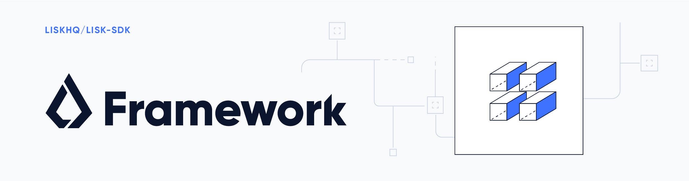

# Lisk Framework

[](http://www.apache.org/licenses/LICENSE-2.0)

## What is Lisk Framework

Lisk Framework is an application framework to create a blockchain application compatible with the Lisk protocol.
It provides an application where off-chain and on-chain logic can be extended with user defined plugins and modules.

### Architecture Overview

The diagram below provides a high-level overview of the architecture:


The framework consists of 3 main parts, an application, a controller and a node.

The application is an entry point and manages the controller and the node. The node is responsible for blockchain protocol logic using user defined modules, while the controller is responsible for maintaining plugins and managing the interaction between plugins and the application.

## Installation

```sh
$ npm install --save lisk-framework
```

## Tests

```
npm run test:<testType>
```

`testType` can be `unit`|`integration`|`functional`

##### Executing the tests per file:

```
npm run test:<testType> -- [testPathPattern] [jestCliOptions]
```

## Contribution

To test the changes in framework you can run,

`node test/test_app`

If you want to test the changes in `lisk-sdk/elements` to reflect in `lisk-sdk/framework`, please make sure you run `npm run build` at `lisk-sdk` after making any changes in elements library and run `node test/test_app`.

## Get Involved

| Reason                          | How                                                                                            |
| ------------------------------- | ---------------------------------------------------------------------------------------------- |
| Want to chat with our community | [Reach them on Discord](https://discord.gg/lisk)                                               |
| Found a bug                     | [Open a new issue](https://github.com/LiskHQ/lisk/issues/new)                                  |
| Found a security issue          | [See our bounty program](https://blog.lisk.io/announcing-lisk-bug-bounty-program-5895bdd46ed4) |
| Want to share your research     | [Propose your research](https://research.lisk.io)                                              |
| Want to develop with us         | [Create a fork](https://github.com/LiskHQ/lisk/fork)                                           |

## License

Copyright 2016-2020 Lisk Foundation

Licensed under the Apache License, Version 2.0 (the "License");
you may not use this file except in compliance with the License.
You may obtain a copy of the License at

http://www.apache.org/licenses/LICENSE-2.0

Unless required by applicable law or agreed to in writing, software
distributed under the License is distributed on an "AS IS" BASIS,
WITHOUT WARRANTIES OR CONDITIONS OF ANY KIND, either express or implied.
See the License for the specific language governing permissions and
limitations under the License.
